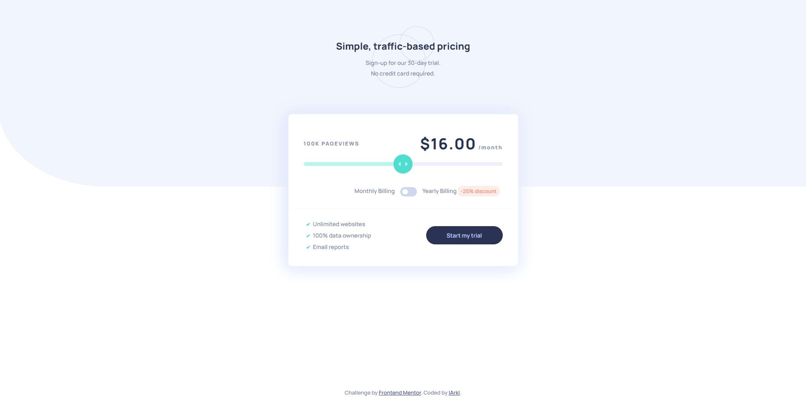

# Frontend Mentor - Interactive pricing component solution

This is a solution to the [Interactive pricing component challenge on Frontend Mentor](https://www.frontendmentor.io/challenges/interactive-pricing-component-t0m8PIyY8). Frontend Mentor challenges help you improve your coding skills by building realistic projects. 

## Table of contents

- [Overview](#overview)
  - [The challenge](#the-challenge)
  - [Screenshot](#screenshot)
  - [Links](#links)
- [My process](#my-process)
  - [Built with](#built-with)
  - [What I learned](#what-i-learned)
  - [Continued development](#continued-development)
  - [Useful resources](#useful-resources)
- [Author](#author)
- [Acknowledgments](#acknowledgments)

## Overview

### The challenge

Users should be able to:

- View the optimal layout for the app depending on their device's screen size
- See hover states for all interactive elements on the page
- Use the slider and toggle to see prices for different page view numbers

### Screenshot

### Links

- Solution URL: [https://www.frontendmentor.io](https://www.frontendmentor.io/solutions/mobile-first-solution-with-css-grid-areas-Bk5cMjdVq)
- Live Site URL: [https://larkl.github.io](https://larkl.github.io/fm-interactive-pricing-component/)

## My process

### Built with

- Semantic HTML5 markup
- CSS custom properties
- Flexbox
- CSS Grid
- Mobile-first workflow
- [React](https://reactjs.org/) - JS library
- [Next.js](https://nextjs.org/) - React framework
- [Styled Components](https://styled-components.com/) - For styles

**Note: These are just examples. Delete this note and replace the list above with your own choices**

### What I learned

Practiced CSS grid areas and learned native component modification with pseudo selectors.

### Continued development

Update font sizing for different screens.

### Useful resources

- [W3Schools - CSS Switch](https://www.w3schools.com/howto/howto_css_switch.asp) - This helped me to make the switch component with just css.

## Author

- Website - [lArkl](https://github.com/lArkl)
- Frontend Mentor - [@lArkl](https://www.frontendmentor.io/profile/lArkl)

## Acknowledgments

